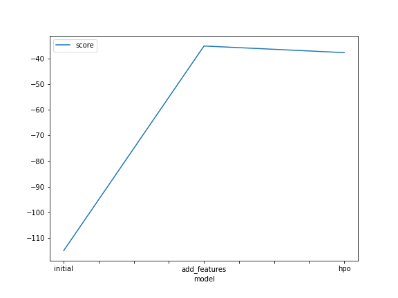
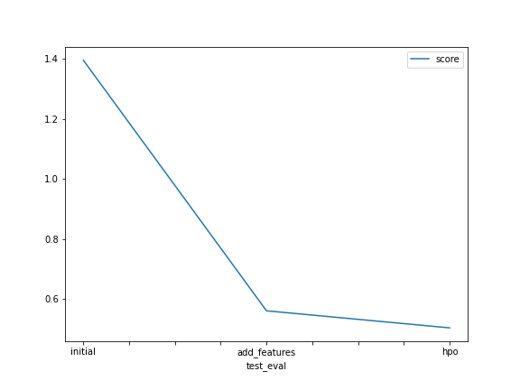

# Report: Predict Bike Sharing Demand with AutoGluon Solution
#### Rajat Sharma

## Initial Training
### What did you realize when you tried to submit your predictions? What changes were needed to the output of the predictor to submit your results?
After prediction, I found some negative values in the predicted value. Since our target variable is "Count", so this is supposed to be a positive entity. Therefore, I converted all the negative values to zero as it is the closest positive number. 

### What was the top ranked model that performed?
XGBoost_BAG_L1/T0

## Exploratory data analysis and feature creation
### What did the exploratory analysis find and how did you add additional features?
During exploratory analysis, I found out that there is one object datatype "Date" which can be used effectively on disintegrating it into quantitative features. So I separated it into day, hour and year.

### How much better did your model preform after adding additional features and why do you think that is?
The model performance improved by 66 percent. In my opinion, conversion of non-linear datetime feature to quantitative features (hour, day, year), helped the model to understand the data effectively. 

## Hyper parameter tuning
### How much better did your model perform after trying different hyper parameters?
Hyperparameter tuned model (XGBoost_BAG_L1/T0) scored better than initial model but slightly lower than added featured model. But it scored well on the kaggle score by 64 percent from the initial and 10 percent from the feature added model.

### If you were given more time with this dataset, where do you think you would spend more time?
I would like to apply the hyperparameter tuning for other set of models participating in the AutoML. 

### Create a table with the models you ran, the hyperparameters modified, and the kaggle score.
|model|model_name|n_estimator	|n_jobs|score|
|--|--|--|--|--|
|initial|RandomForestMSE_BAG_L1|300.0|-1|1.39561|
|add_features|KNeighborsDist_BAG_L1|NaN|-1|0.56007|
|hpo|XGBoost_BAG_L1/T0|10000.0|-1|0.50320|

### Create a line plot showing the top model score for the three (or more) training runs during the project.

### Create a line plot showing the top kaggle score for the three (or more) prediction submissions during the project.

## Summary

This project really helped me to understand how Autogluon can be used to test different models with AutoML capability. This eased out the process of training, testing and evaluating different models that can be applied on a dataset. In addition to that, there is a flexibility to add new features and perform hyperparameter tuning for some specific model and that really helped me to achieve the best score for this kaggle competition. 
